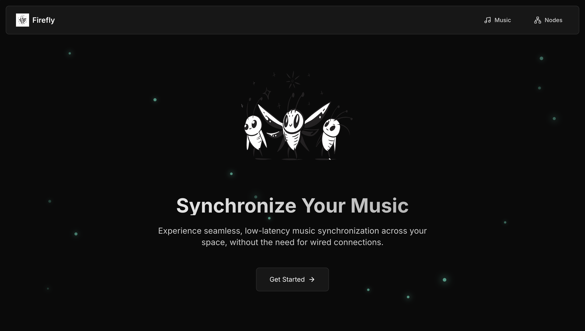
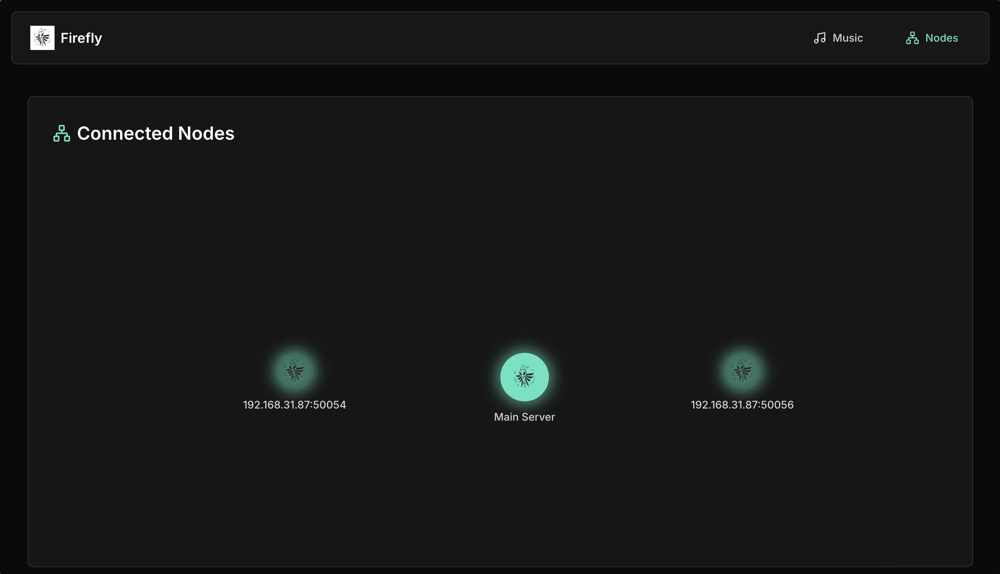
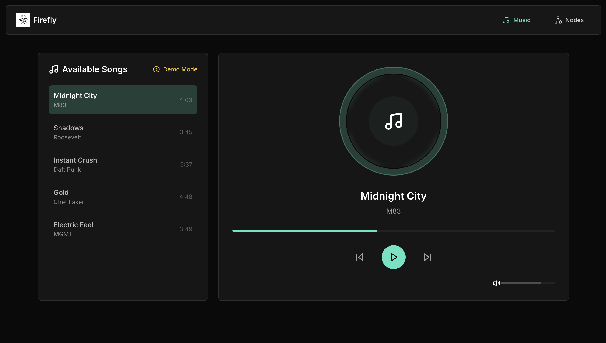

# Firefly beta

Current approach - P2P system with master node for sync







## Setup

Clone the Repository  
```sh
git clone https://github.com/HelixY2J/firefly.git
cd firefly
```

Navigate to the backend directory and install Go dependencies:
```sh
cd backend
go mod tidy
```

Start the Firefly master server:
```sh
go run cmd/core/main.go
```

Each client connects to the master for playback synchronization

For linux/macOS:
```sh
CONSUL_ADDR="192.168.x.x:8500" go run cmd/client/main.go
```

On Windows (PowerShell):
```powershell
$env:CONSUL_ADDR="192.168.x.x:8500"; go run cmd/client/main.go
```
Once the server is running, open the web UI in your browser
```sh
http://localhost:8081
```
This allows you to control playback, view active nodes, and manage files


## Design 

Each music node has
- db to track files
- grpc server
- inbuilt audio player
- web interface

master client model
- master node should have central databse with file metadata
- tracks all conn clients - syn playback
- client req missing file chinks from master, maybe other clietn too

file deduplication
- files are split into chunks and fingerprinted
- chunks are stored logically 
- clients only download mising chinks instead of full files

comm by grpc
- nodes comm over grpc, handling metadata transfer, file transfermplayback snyc
- heartbeats, lib updates,chunk req

## The system flow

1. **Nodes Join via Heartbeats**
    
    - Clients send a heartbeat to the master.
    - Master assigns a unique node ID and shares the group status.
    - Master removes inactive nodes after a timeout, notifying others.
2. **Library Synchronization**
    
    - Clients periodically sync their file list with the master.
    - Master compares the client’s list with the authoritative library and sends back only changes (deltas).
3. **File Download Process**
    
    - Clients request metadata from the master (to get chunk info).
    - They check which chunks they already hav and only request missing ones.
    - Chunks are downloaded using load balancing  across available nodes.
4. **Synchronized Playback**
    
    - Any node can request synchronized playback by the master.
    - Master sends control requests to all clients.
    - Clients respond once ready after downloading the file
    - Master waits for all active clients before issuing a final playback command

## Known Upcoming challenges
- How handling network failures like when master nodes crashes
- Latency !!!
- Implement Downloading Features for Missing Audio Files
- Metadata Fingerprinting - Clients Should Request Chunks from Other Clients
- Support MP3 and Other Audio Formats
- Integrate Spotify 


## Unknown challenges
???

## Did you know 

Fireflies, despite blinking randomly at first, can synchronize their flashes when in large groups. This phenomenon, called synchronous flashing, occurs due to a natural feedback mechanism - Initially, each firefly blinks at its own rhythm.They adjust their timing based on nearby flashes. Over time, all fireflies in a group start flashing in perfect unison.

Check out this [experiment](https://youtu.be/ZGvtnE1Wy6U?si=9Eex4CEr5p6bOe9R) where thousands of live fireflies are made to synchronize their flashes with a few computer controlled LED’s 

